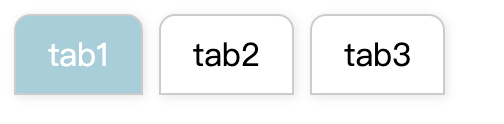

<h1 align="center">好用的幾個 Vue component</h1>

<p>真的很好用ㄛ</p>

## Example upload-input



```
<div id="app">
  <!-- 將 component 放這邊 -->
  <upload-input
    :tab-items="['tab1', 'tab2', 'tab3']"
    @tab-changed="handleTabClicked"
  ></upload-input>
</div>
<script type="module">
  import { createApp, ref } from 'vue'
  import {
    UploadInput // 換成要驗證的元件， 記得先 npm run watch
  } from '../dist/MyLibrary.es.js'
  createApp({
    components: {
      UploadInput // 換成要驗證的元件
    },
    setup() {
      const val = ref('tab1')
      const handleTabClicked = tab => {
        val.value = tab
      }
      return { handleTabClicked }
    }
  }).mount('#app')
</script>

```

# Example copy-button

```
<div id="app">
  <copy-button></copy-button>
</div>
<script type="module">
  import { createApp, ref } from 'vue'
  import {
    CopyButton, // 換成要驗證的元件， 記得先 npm run watch
  } from '../dist/MyLibrary.es.js'
  createApp({
    components: {
      CopyButton,
    },
    setup() {},
  }).mount('#app')
</script>
```
